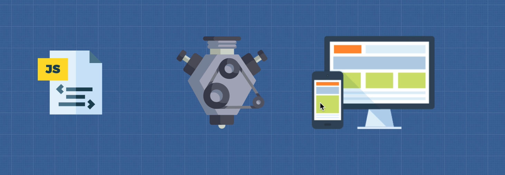

# DEV-01, Javascript Engine Part 1

## Tags: [engines]

### Link:[<https://www.udemy.com/course/advanced-javascript-concepts/learn/lecture/13760022#overview>]

## What is an engine

    In a sense, an engine is a translator so you can communicate with somebody that doesn't know your language.
    So is the same with engines in context with you JS file and the computer.

## What was the first Engine?

    SpiderMonkey, created by Brendan Eich, He created The Javascript Language and Cofounded Mozilla. 
    To this day Mozilla still uses this engine.

## Are there many other JS engines?

    Yes, here are several: <https://en.wikipedia.org/wiki/List_of_ECMAScript_engines>

## Why did Google create V8 engine?

    Google had this problem with Google Maps and it requried alot of power. Alot of JS engines back then were
    basic and offered slow functionality.

    So with Google Maps and their own Chrome browser, they said, we're going to write our own JavaScript
    engine, the V8 engine, so that JavaScript runs way faster on the browser than it's done previously.

