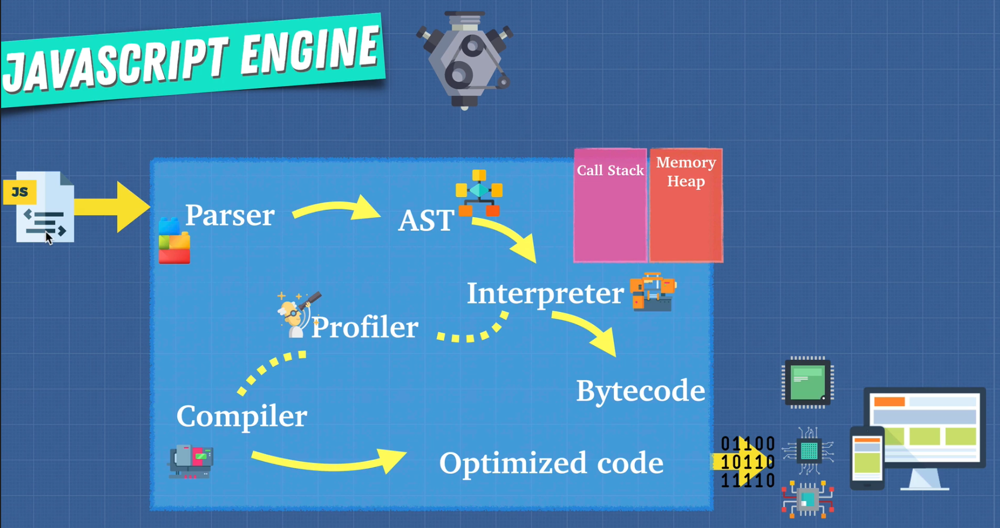
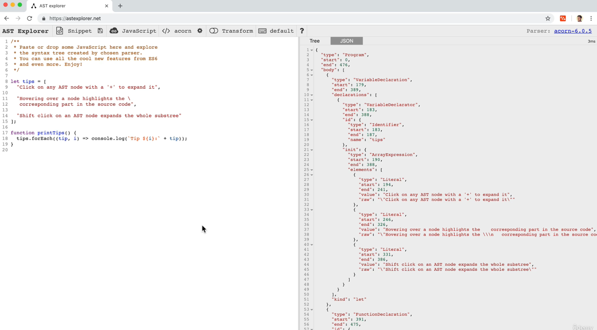

# DEV-02, Javascript Engine Part 2

## Tags: [engines]

### Link:[<https://www.udemy.com/course/advanced-javascript-concepts/learn/lecture/13760038#overview>]

### Building our own Engine

## Parser

    First we give it a JS file and then it undergoes lexical analysis, 
    which breaks the code into tokens to identify their meaning.

## AST

    These tokens are formed into an Abstract Syntax Tree (AST)
    this allows the engine to understand what's going on in the program and break things down one by one.

