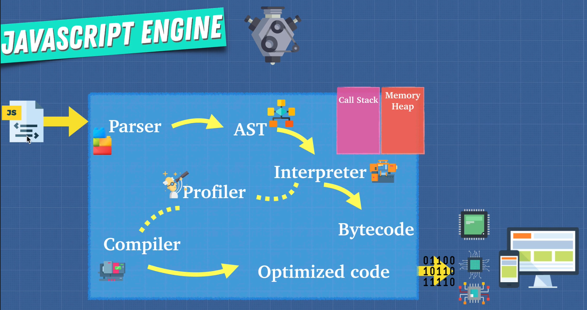
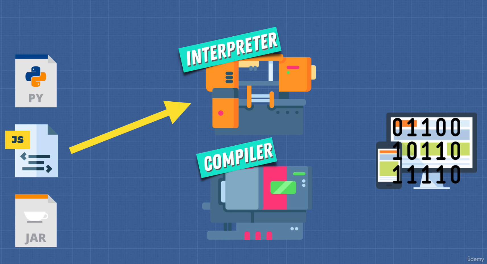
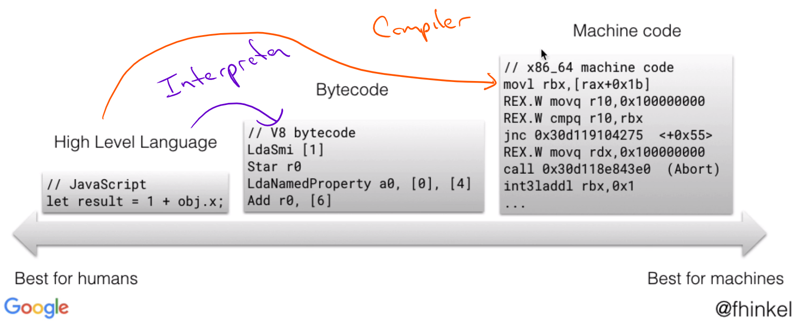

# DEV-04, Interpreters and Compilers

## Tags: []

### Link:[<https://www.udemy.com/course/advanced-javascript-concepts/learn/lecture/13760048#overview>]

## Interpreters

    An interpreter translates and read the files line by line on the fly. 
    Interpreting code simply means taking a set of instructions.

## Compilers

    Compiler unlike the interpreter does not translate on the fly
    It works ahead of time to create a translation of what code we've just written.
    And then it compiles down to usually a language that can be understood by our machines.

    This time around, it's going to take one pass through the code and try to 
    understand what the code does.

    And it's going to take the program in JavaScript or any type of language and write
    a new program in new language

    All languages have to be interpreted and compiled.
    Because it has to run.

    It has to be interpreted and it also has to most likely get translated into 
    something low level like machine code, for example.

## More details

    Most languages are both compiled and interpreted

## Other Compilers

    Babel and Typescript are also compilers, take one language and convert into a different one.
