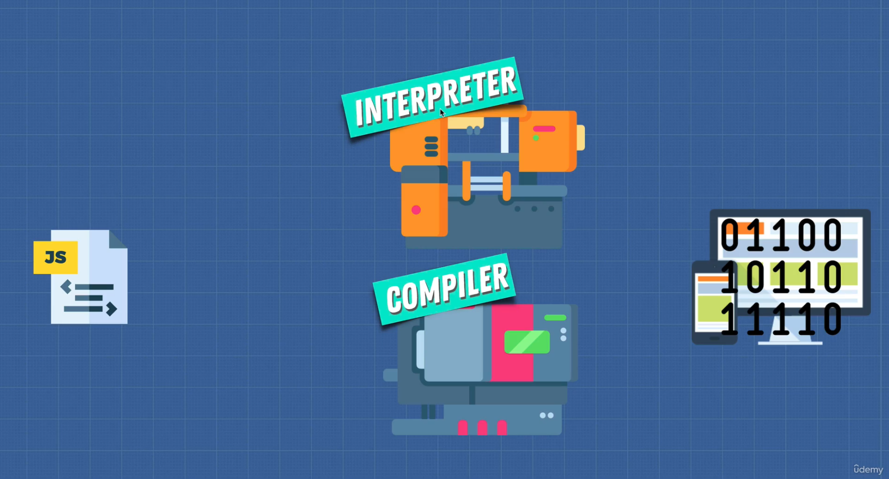
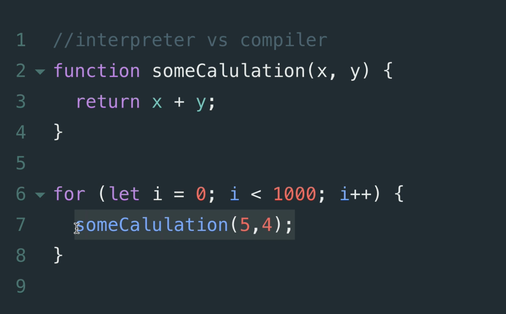
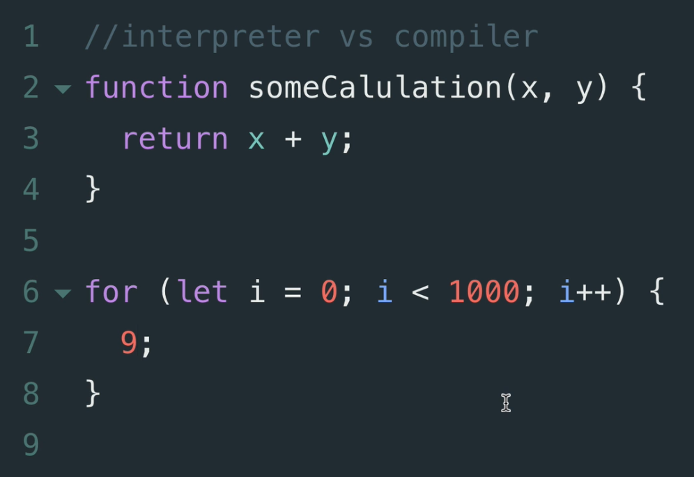
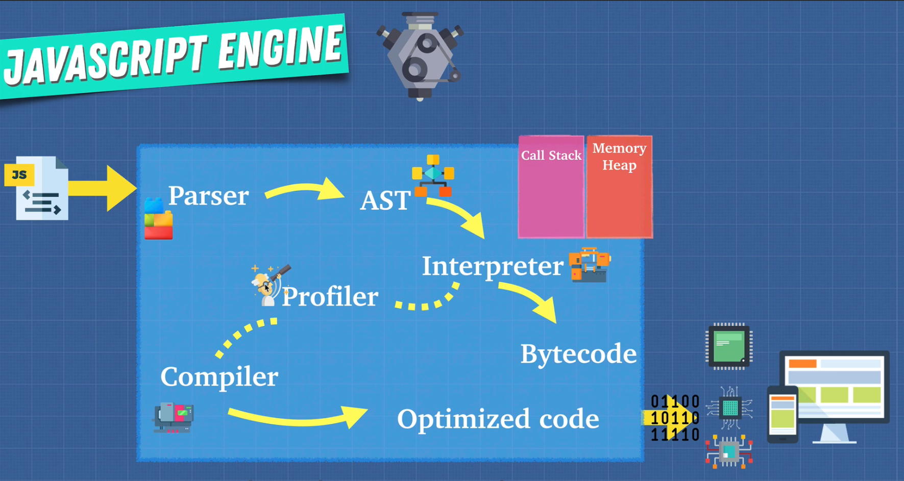

# DEV-05, Interpreters vs Compilers

## Tags: [engines]

### Link:[<https://www.udemy.com/course/advanced-javascript-concepts/learn/lecture/13760060#overview>]

## Interpreter

    Interpreters are quick to get up and running.
    There's no compilation step before you can start running your code.
    An interpreter starts translating their first line and just runs the code for us.

    Because of this, an interpreter is a natural fit for something like JavaScript, right, a JavaScript
    file gets sent from the server to the browser to the client on the front end.
    And we want that JavaScript to execute right away because our users are going to be waiting on the Web

## Con with interpreter

    the problem with interpreters is that when you're running the same code more than once, for example, 
    if you're in a loop like this one over here where we're running this piece of code over and over and over,
    even though it gives us the same result, it can get really, really slow. The compiler helps with this.

## Compiler

    It takes a little bit more time to start up because it has to go through that compilation step at the
    beginning, go through our code, understand it and spit it out into a another language.
    
    But the compiler will be smart enough that when it sees code like this, and this is obviously a simplified
    version of it, but if it sees code like this that we just loop over and it has the same inputs returning
    the same outputs, well, it can actually just simplify this code.

    Because a compiler doesn't need to repeat the translation for each pass through in that loop, the code
    generated from it is actually faster.
    And these sort of edits that compilers do are called optimisations.

## Is there a way to get the best of both worlds?

    This is the same question that Google solved with the V8 engine, this was the Just In Time compiler.
    JIT compilation make engines faster.

## Profiler

    The profiler also called a monitor, monitors and watches our code as it runs.
    It makes notes on how we can optimize this code, such as how many times it is being run, what types
    are used and how we can possibly optimize this.

    And using this profiler as the code is running through our interpreter, which tells our browser what
    to do. If the same lines of code are run a few times. We actually pass off some of this code to the 
    compiler or a JIT compiler.

    The interpreter is going to say, hey, here's some code for you to optimize, passes it off to the
    compiler and the compiler as the application is running, takes a code and compiles it or modifies it.

    This means that the execution speed of the JavaScript code that we entered into the engine is going
    to gradually improve.

## Why did we go over this?

    Now that we know how the engine works underneath the hood, we can write more optimized code code that
    the compiler can take and run faster than our regular JavaScript. We are going to learn how we can help 
    out the profiler and compiler
