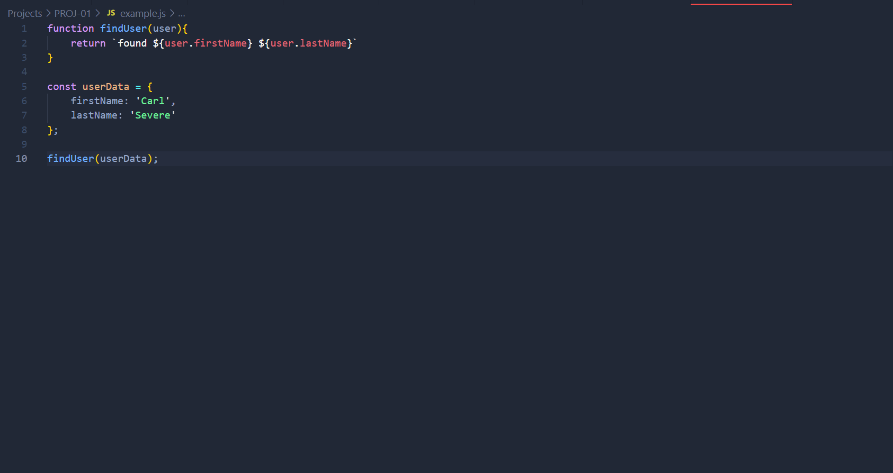
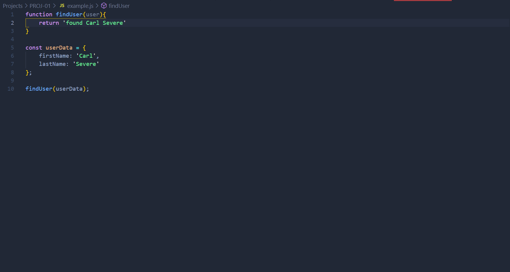
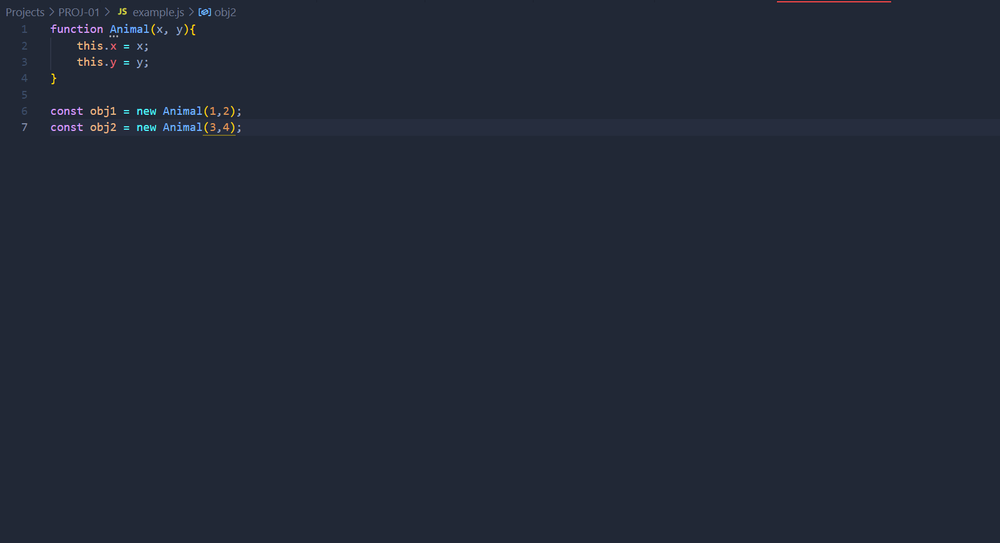
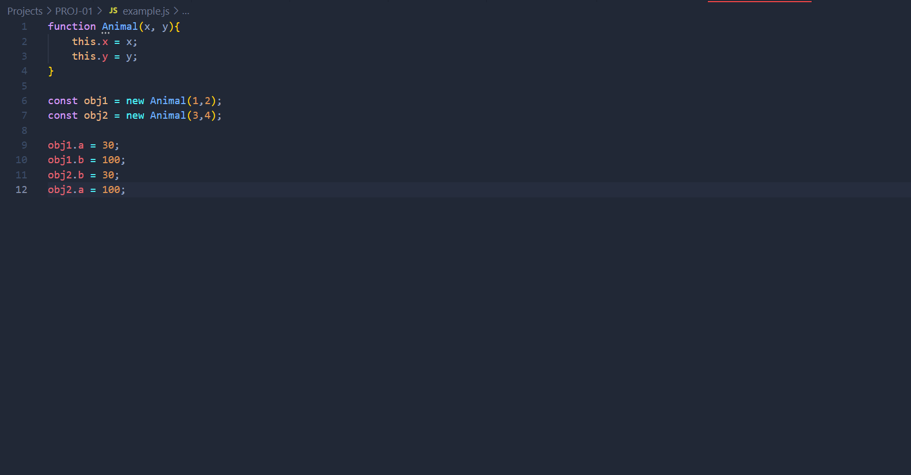

# DEV-07, How can I help the JS engine

## Tags: [engine]

### Link:[<https://www.udemy.com/course/advanced-javascript-concepts/learn/lecture/13760064#overview>]

## These in practice can be probematic for optimization

## eval()
    
    Functions that call literally the eval function, which comes with JavaScript, can be very problematic.

## arguments

    There are many ways that we can use this keyword by JavaScript, 
    but there are just as many ays that makes compilers unoptimizable.

## for in

    When looping over objects can be problematic sometimes.
    Using Object.key() is a great alternative for iterating

## with 

    Who?

## delete

    potentially with objects

## Why are these so destructive?
    First gotta understand these good optimizing actions first:
        Inline Caching
        Hidden Classes

## What is inline Caching?

    Now, inline caching does something really interesting due to inline caching done by the compiler code
    that executes the same method repeatedly, that is, let's say the findUser function was
    being called multiple times.

    Well, the compiler can optimize this so that whenever it's looking for the user data, which has first
    name and last name, it can use something called inline caching.

    Where instead of looking up this object every time, finding the key that is first name and last name
    and then their values, it will cache or inline cache so that find user just becomes this piece of text.

## What are Hidden Classes

    Now, a compiler is going to take a look at this and say, all right, we have an animal that we're
    creating here and we're assigning it to obj1 and obj2.

    If you do something like this:

    That code is actually going to make the compiler run slower or deoptimize the code.
    And that is something called hidden classes.

    You want to try and instantiate your object properties in the same order so that hidden classes, which
    is what the compiler uses underneath the hood.

    In the previous picture obj1 and obj2 have the same hidden class, that is they have the same properties.
    But as soon as you start intorducing thing in different orders, it's going to get confused and say:
    "They dont have a shared hidden class. They are two seperate things" 

    This will slow thing down.

    This is why the constructor is important as it makes sure that the things are added in the same order.

# delete revisited

    Hidden classes is also why the delete keyword is problematic.
    It changes the hidden classes and so instances of Animal do not match up anymore.

## What should I take away from all this?

    The key takeaway from here is that we should write code that is predictable not only for humans, but
    also for machines.

    The more predictable your code is, the less confused the compiler will get.