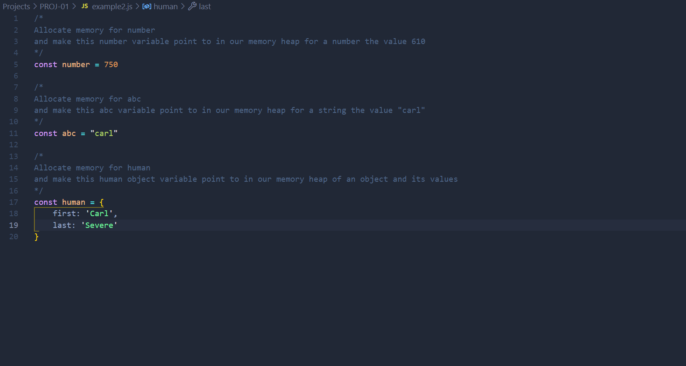

# DEV-09, Call Stack and Memory Heap

## Tags: [stack, heap]

### Link:[<https://www.udemy.com/course/advanced-javascript-concepts/learn/lecture/13760072#overview>]

## What is this for?

    We need a place to store and write information.
    That is to store our variables, our objects, our data of our apps and a 
    place to actually run and keep track of what's happening line by line on our code.

## Memory Heap

    We need the memory heap as a place to store and write information, because at the end of the
    day programs are just read and write operations.

    That way we have a place to allocate memory, use memory and release memory

## Call Stack

    We nee a place to keep track of where we are in the code so that the code can run in order

## Deeper into the Memory Heap

    Our memory heap is simply a Freestore is a large region in memory that the JavaScript engine provides
    for us, which can be used to store any type of arbitrary data in an unordered fashion.
    There's no order to this memory.

    It just allows us to use variables to point to different storage areas, just like a little cupboard.
    And a lot of science goes into optimizing the way space is allocated here.
    But we know that the engine takes care for us to put data into storage boxes for us.

## Deeper into the Call Stack

    We can think of the call stack as a region in memory, which operates in first in last out mode.
    The Call stack stores functions and variables as you code executes at each entry state
    of the stack (stack frame) which allows us to know where we are in the code.

## Javascript specific implementations of the Memory Heap and Call Stack

    Since every JavaScript engine has different implementations, where variables are allocated is
    is not one hundred percent the same all the time.

    Simple vairbles an usually be stored on the stack
    Object complex data structures like objects, arrays, and functions are stored in memory heap

