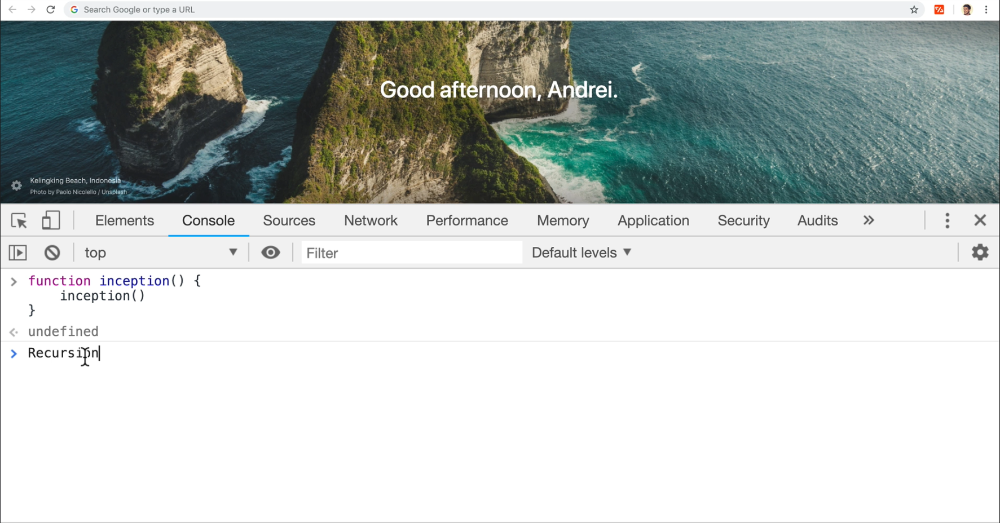

# DEV-10, Stack Overflow

## Tags: [stack, heap]

### Link:[<https://www.udemy.com/course/advanced-javascript-concepts/learn/lecture/13760074#overview>]

## What happens if we call functions nested inside of each other over and over?

    We get a maximum call stack size exceeded, we actually get a stack frame of what the error is.

    Back in the day with Chrome, it wouldn't give you this error 
    and the browser will eventually just crash.

    But in order to prevent the browser from crashing, if it reaches a limit, 
    it's going to print out this error saying, hey, you've just created a stack overflow.

    Is there a way to do something like this with the Memory Heap?