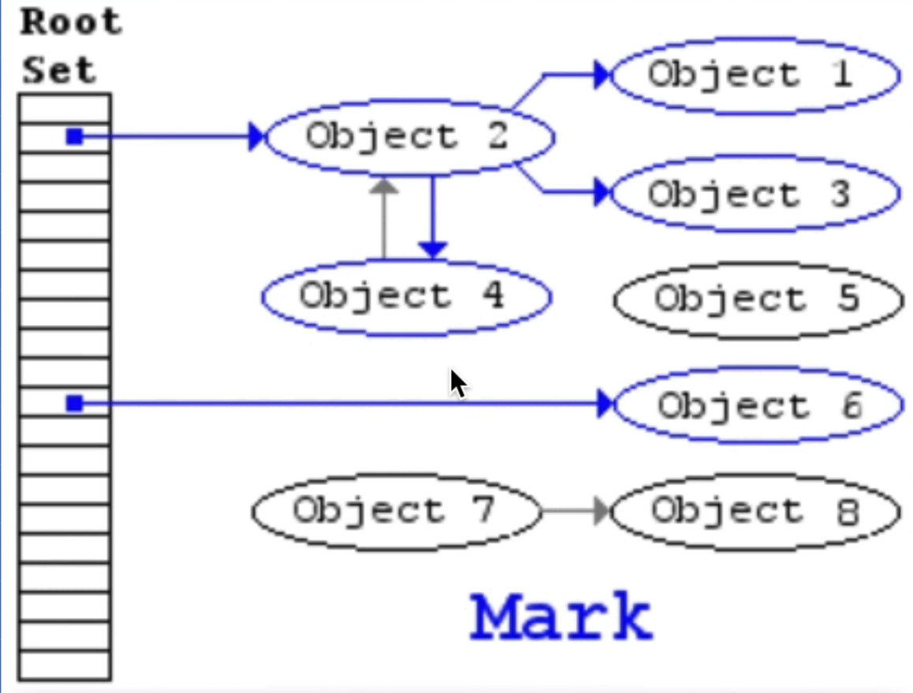
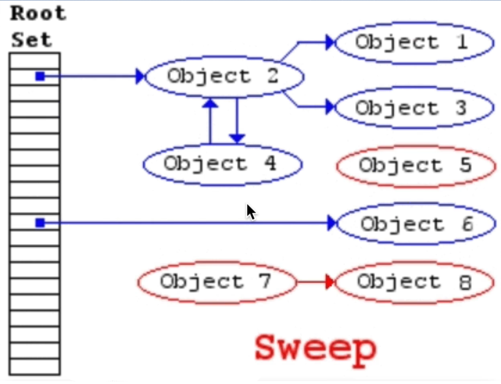
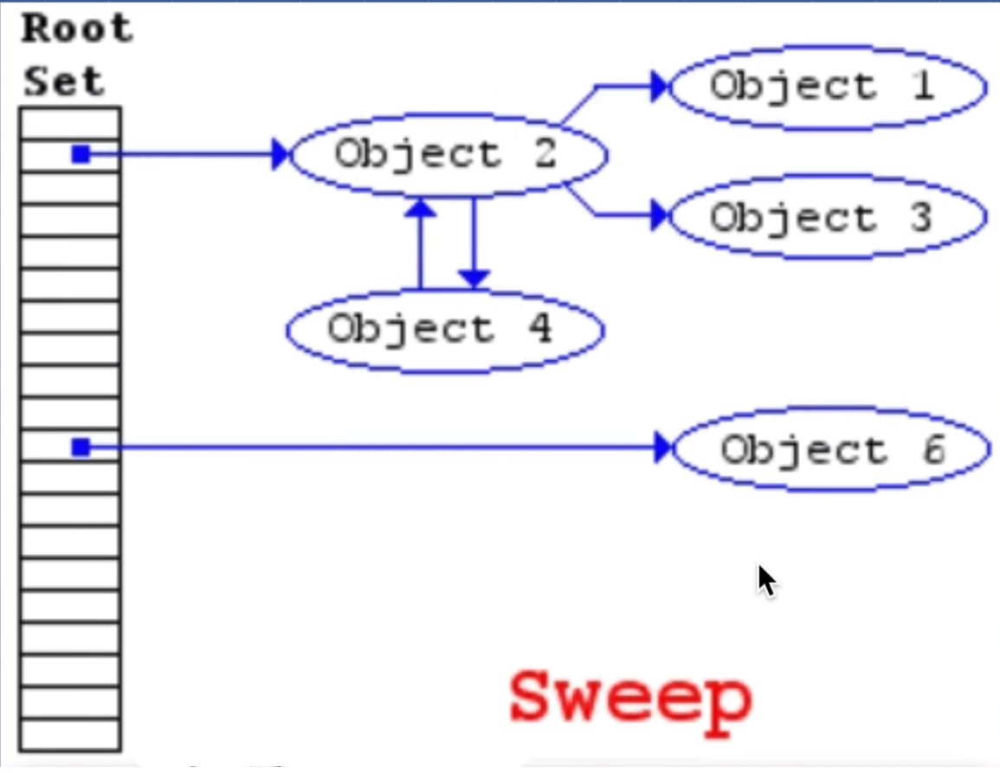

# DEV-11, Garbage Collection

## Tags: [heap]

### Link:[<https://www.udemy.com/course/advanced-javascript-concepts/learn/lecture/13760078#overview>]

## Javascript is a garbage collected language

    That means when JavaScript allocates memory, let's say within a function, we create an object and
    that object gets stored somewhere in our memory heap.

    Automatically with JavaScript, when we finish calling the function and let's say we don't need
    that object anymore, it's going to clean it up for us.

    So JavaScript automatically frees up this memory that we no longer use and well, collect our garbage.

## What are memory leaks?

    That is when the memory gets too big, too big, until we reach our maximum size.

## Is Garbage collection perfect?

    Garbage collection gives us a false sense of security that, oh, we don't have to worry about
    memory management because this garbage collection is done automatically and it's smart 
    enough to figure out what we need and what we don't.

    This is a big mistake.

## How does garbage collection actually work in JavaScript?

    It uses something called Mark and Sweep Algorithm, and this is a great video that shows how

