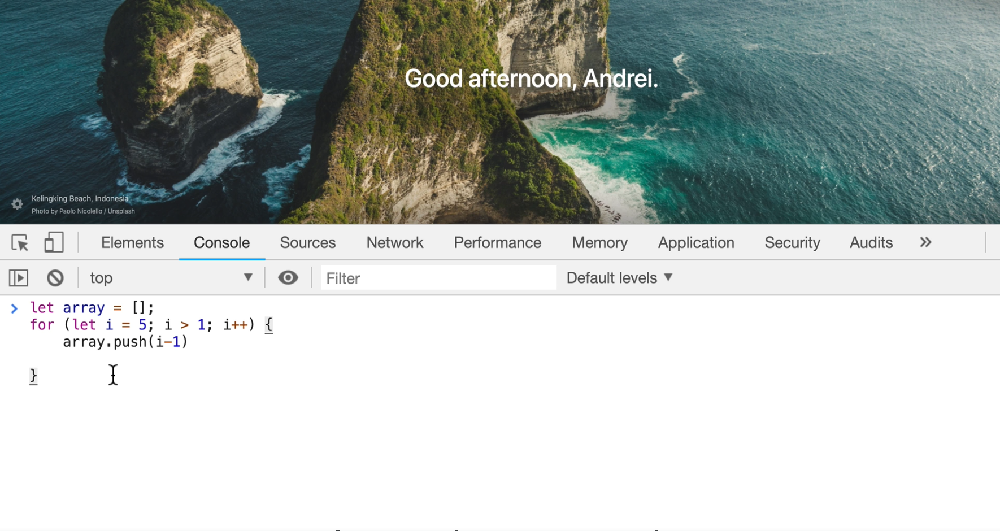
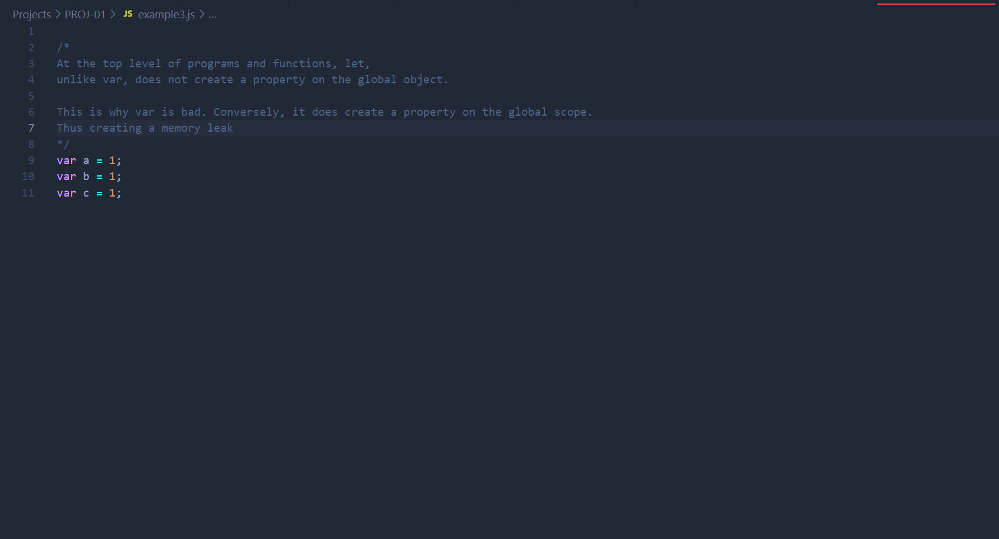

# DEV-12, Creating our own memory leak

## Tags: [heap]

### Link:[<https://www.udemy.com/course/advanced-javascript-concepts/learn/lecture/13760080#overview>]

## How to cause a memory leak

    Memory leaks are pieces of memory that the application have used in the past, but is not needed
    any longer, but has not yet been returned back to us to the pool of free memory.

    there are three common memory leaks
    Gloabal Variables
    Event listeners
    setInterval

## Global Variables

    Hypothetically, I just keep adding variables to my environment, well, we're adding more and
    more pieces of memory.

    And if these were objects and deeply nested objects you can see memory being used up more and more;

## Event Listeners

    Now, this is one of the most common ways to leak memory, and that is you add this event listeners
    and you never remove them when you don't need them, so that you keep adding, keep adding, keep adding
    event listeners.

    And because they're just there in the background, you forget about them.
    And next thing you know, you create a memory leak.

    This happens a lot, especially if you go back and forth between single page applications where you're
    not removing the event listeners off the page and as a user goes back and forth, back and forth, the
    memory keeps increasing more and more as more event listeners are added.

## SetInterval

    Simply using setInterval is a big no. We need to at least make sure we clear the interval and release the memory

## Memory is limited

    That is when it comes to the call stack and memory heap.
    Those are two places that JavaScript remembers or stores memory and we have limited use of them.
    So for us to write efficient code, we have to be conscious to not have stack overflow or a memory leak.
    and to manage that memory well.