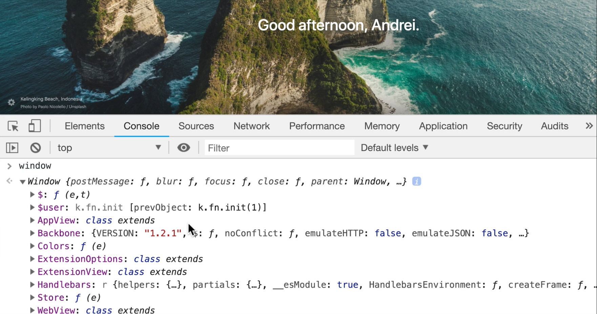
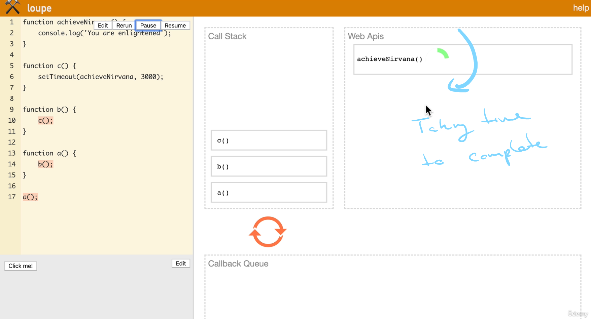
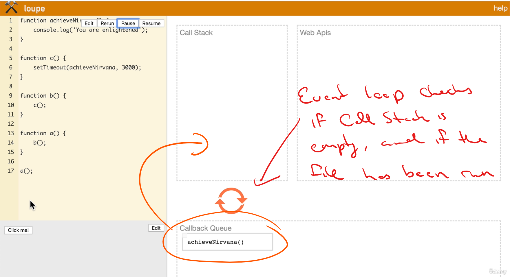

# DEV-14, Javascript Runtime

## Tags: [threads]

### Link:[<https://www.udemy.com/course/advanced-javascript-concepts/learn/lecture/13760086#overview>]

## Javascript has only one stack and one heap

    Hence, if any other program wants to execute something, it has to wait until the previous program
    or function is completely executed. And if I do something that takes a really, really long time, well,
    things are going to be really slow for our program.

    That's not good. Enter the Javascript RunTime.

## Javascript RunTime

    In this case, the Web browser is working in the background while the synchronous JavaScript code is
    running. It's using something called the Web API or the Web browser API to communicate and let the
    JS engine know. Hey, I'm back with some data, some work that you told me to do in the background.

    These Web APIs are applications, which can do a variety of things like send HTTP requests, 
    listen to DOM events, click event on the DOM, ect.

## Web API

    When I look at the window object,
    This is the Web API that we can use so that if I scroll down here, I can see different things that
    the browser provides for us that our JavaScript engine can use.

    SetTimeOut, SetInterval, all of them are provided by the browser, they are not Native to Javascript.

    So remember that the browsers are helping us create rich web applications so that users aren't just
    sitting around waiting for our JavaScript to execute anything that can be uploaded.
    They'll take care of that for us in the background, because you can imagine if the browser had to use
    the same JavaScript thread for execution of these features.
    Well, it's going to take a really, really long time.

## What going on then?

    So browsers actually underneath the hood use low level programming languages like C++ to perform these
    operations in the background. (Similar to how node.js works with libuv potentialy)

    Now, behind the scenes, the Web API is going to take the set time out.
    It's going to start a timer.
    That is going to run for one second.
    And once that one second is over, 
    it's going to push the callback to the call back queue.

    The Event loop is contantly checking the call stack to see if its empty
    after the entire JS file has been read

### Another look
<http://latentflip.com/loupe/?code=JC5vbignYnV0dG9uJywgJ2NsaWNrJywgZnVuY3Rpb24gb25DbGljaygpIHsKICAgIHNldFRpbWVvdXQoZnVuY3Rpb24gdGltZXIoKSB7CiAgICAgICAgY29uc29sZS5sb2coJ1lvdSBjbGlja2VkIHRoZSBidXR0b24hJyk7ICAgIAogICAgfSwgMjAwMCk7Cn0pOwoKY29uc29sZS5sb2coIkhpISIpOwoKc2V0VGltZW91dChmdW5jdGlvbiB0aW1lb3V0KCkgewogICAgY29uc29sZS5sb2coIkNsaWNrIHRoZSBidXR0b24hIik7Cn0sIDUwMDApOwoKY29uc29sZS5sb2coIldlbGNvbWUgdG8gbG91cGUuIik7!!!PGJ1dHRvbj5DbGljayBtZSE8L2J1dHRvbj4%3D>

## Understanding the nature of the Callback Queue is key

    No matter how fast this set time out timer happens, it still gets sent to the Web API, still gets
    sent to the callback queue and the event loop still needs to check those two checks.