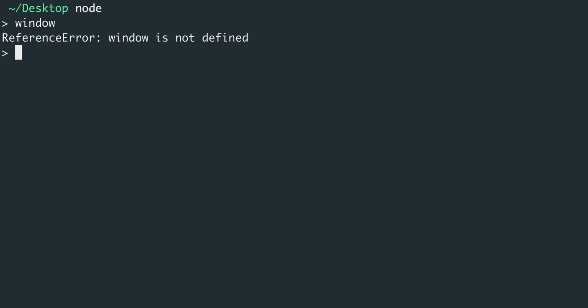

# DEV-15, Node.js

## Tags: []

### Link:[<https://www.udemy.com/course/advanced-javascript-concepts/learn/lecture/13760090#overview>]

## Break down

    Javascript is the musical notes
    Javascript Engine is like the composer
    Javascript Runtime is like the whole orchestra

## Node.js is Javascript Runtime

    It is an orchestra led by the V8 composer
    Node.js is a C++ program that provides this Javascript runtime for us

    When it comes to node.js, there are a few differences, but it works the same way as our diagram (In DEV-14).
    We have our V8 engine. And then we have our event loop and callback queue. and they use something called

    LibUV, which again is written in C++ for us to do these asynchronous operations with the V8 engine.

## Node.js can do a bit more

    In the case of a browser, we're limited to what we can do in the background.
    Right. The browser isn't going to allow us to do much on the person's computer. Like file systems.
    That would be a huge security flaw.

    But in node, we can pretty much do most of the things in the background.
    We can access filesystems, we can do all sorts of things. 

    Node.js uses the Google V8 engine to understand the JavaScript, 
    but it uses this LibUV library, which works along to create this event
    loop to extend what we can do in the background.

## Some differences

    Node does not have the window like in the browser

    Instead it has global, and thats its global API

## Differences with other platforms

