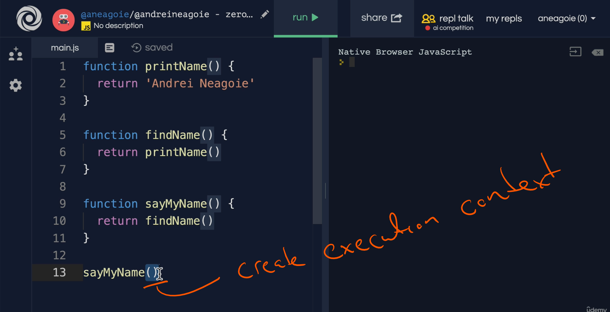
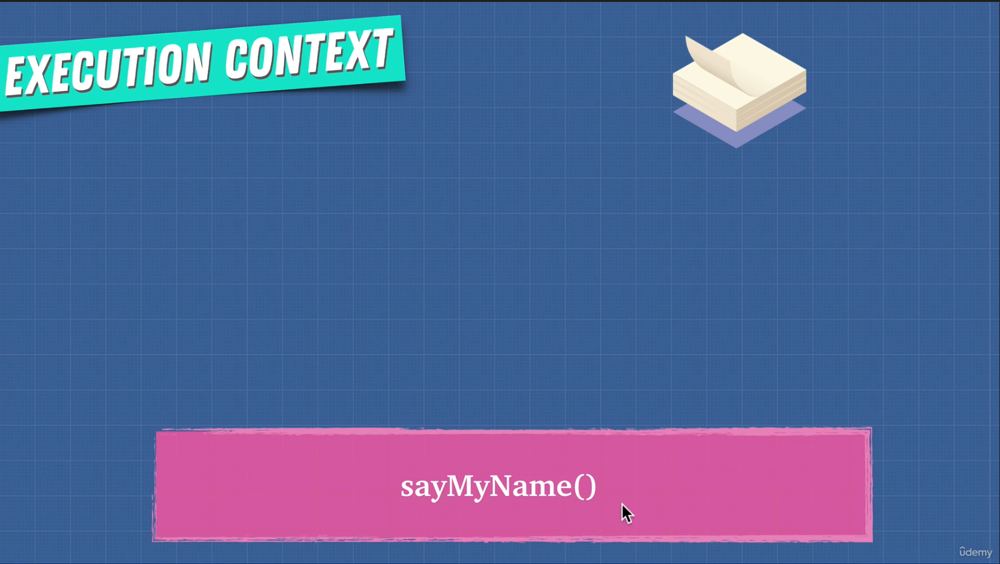
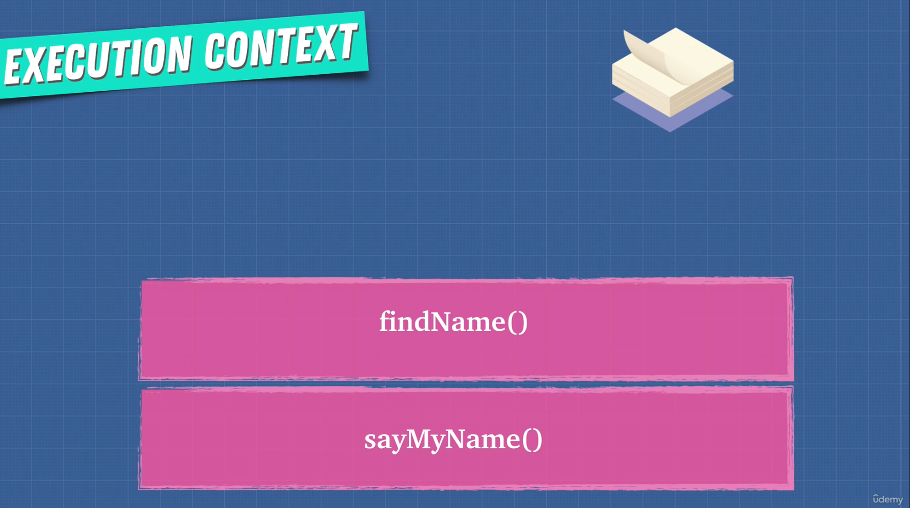
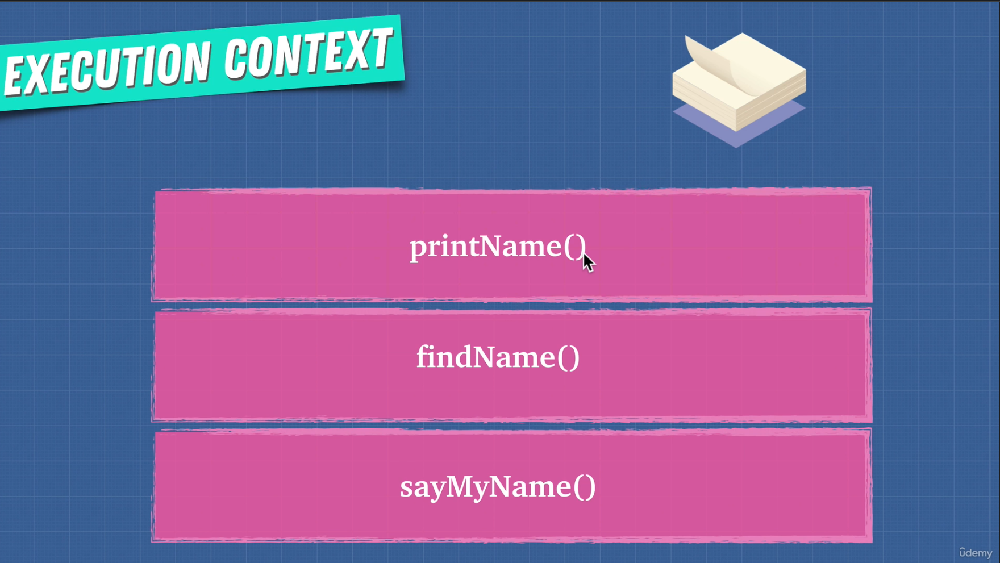
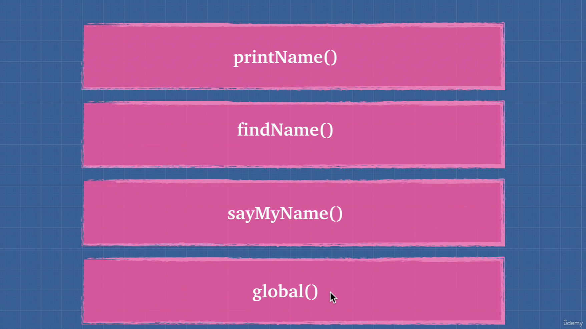
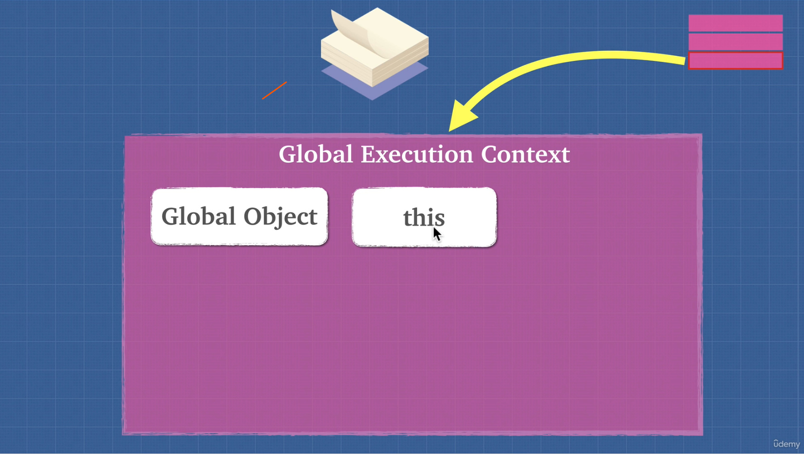
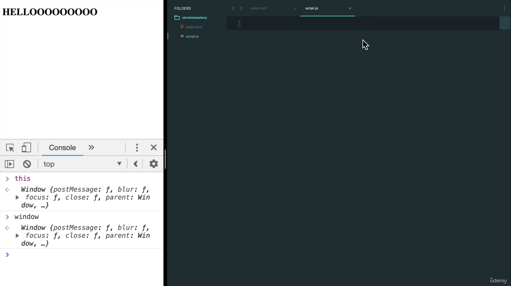

# DEV-16, Execution Context

## Tags: [context]

### Link:[<https://www.udemy.com/course/advanced-javascript-concepts/learn/lecture/13772854#overview>]

## What is it?

    When the JavaScript engine sees those brackets, it's going to say, oh, I'm going to run a function
    and create an execution context.

   

    Adds this execution context onto the stack, and then it tries to run this
    function and sees that this function is calling another function. Create a new execution context.

   

    then its gonna find another function

  

    then once it prints the name and returns its value, each of the functions are removed from the stack in First in Last out (FILO)

    This was actually the global execution context

 

    When everything has been ran, the global context should be popped oof too.

## Global Execution Context

    Global execution context gives us these two things right off the bat when
    the JavaScript engine starts up.

