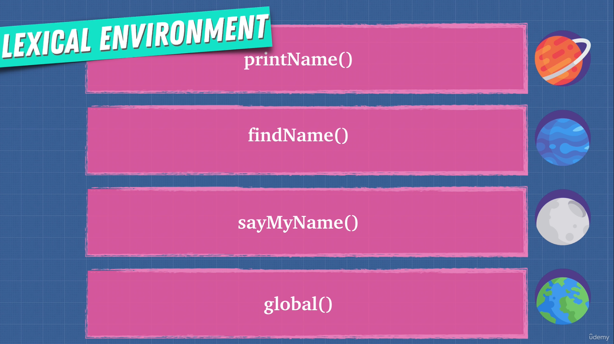
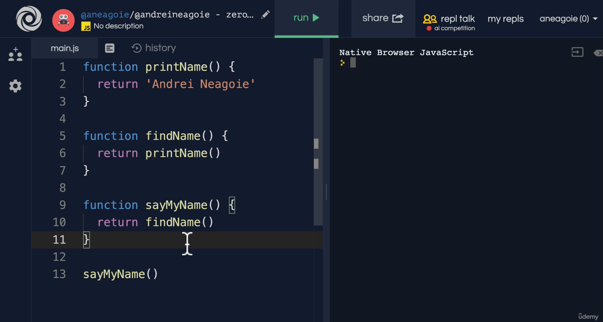
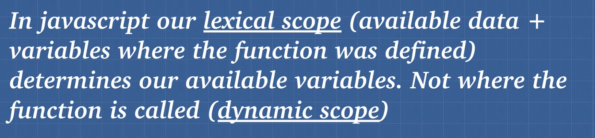

# DEV-17, Lexical Environment

## Tags: [context]

### Link:[<https://www.udemy.com/course/advanced-javascript-concepts/learn/lecture/13772860#overview>]

## What does that mean?

    Lexical environment is simply where you write something, 
    because we now know how our JavaScript engine works.
    That is, it looks through our code and read through our code.

    Well, you can think of lexical environment as these little universes that get created every time we
    create an execution context.

    And if I said something like I'm doing a lexical analysis or a compiler is doing lexical analysis,
    all it's saying is it's checking to see where the words were written and their location.

    What universe is it part of?

## Refering back

    If we go back to our code, what we're saying with a lexical environment, it's saying right now on
    where did we write the function? What part of the universe is it? 

    printName()
    findName()
    sayMyName()

    are all part of the same lexical environment, the global execution context

## Take away

    The very first lexical environment is the global lexical environment, where we write our code.